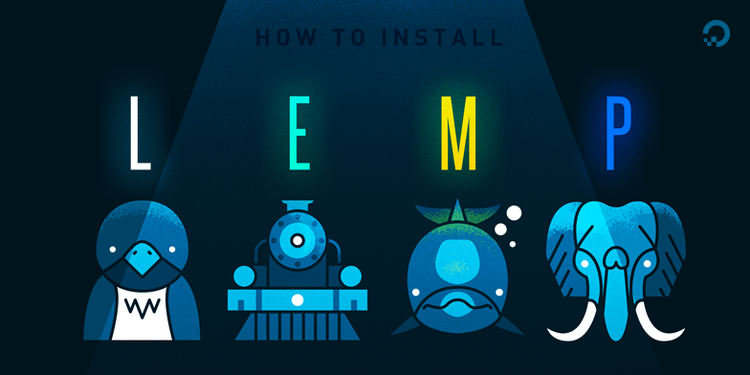

# LNMP stack et FTP avec Docker Compose
<p align="center">

</p>


## Services fournis (fichier docker-compose.yml )

- **nginx** : Serveur HTTP exposé sur le port `8080`, utilisant une configuration personnalisée et les fichiers de `./code`.
- **php** : Exécute le code PHP des fichiers de `./code`.
- **mysql** : Base de données MySQL, persistante via le volume dbdata, exposée sur le port `3306` et accessible notament via `mySQLWorkbench`.
- **phpmyadmin** : Interface web pour MySQL, accessible sur le port `8081`.
- **ftp** : Serveur FTP avec l'utilisateur `bob` et pass `12345`, partageant `./code` et exposant les ports `21` et `30000-30009`.

`Cette configuration est modifiable, il faudra modifier le fichier docker-compose.yml si besoin`.

## PREREQUIS 
- Logiciels installés sur la machine hôte:
    - [Docker](https://docs.docker.com/install/) 
    - [Docker Compose](https://docs.docker.com/compose/install/)

## Installation

```shell
> git clone https://github.com/JR-CIEL-1-RESEAU/Docker-LEMP.git
> cd Docker-LEMP
> docker compose up -d
# visit http://localhost:8080

# Lorsque vous avez fini tapper la commande  :
> docker-compose stop
# vous permettra d arrêter l ensemble des services d une stack ou
> docker-compose down
# vous permettra de détruire l ensemble des ressources d une stack ;
```


Your LAMP stack is now ready!! You can access it via `http://localhost:8080`.


