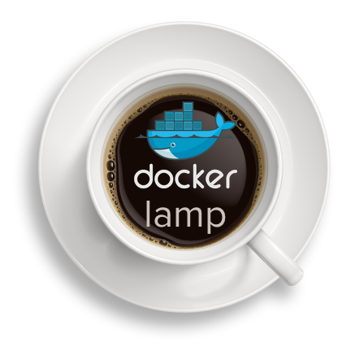

# LAMP stack built with Docker Compose
<p align="center">

</p>


### Services fournis (fichier docker-compose.yml )

- **nginx** : Serveur HTTP exposé sur le port `8080`, utilisant une configuration personnalisée et les fichiers de `./code`.
- **php** : Exécute le code PHP des fichiers de `./code`.
- **mysql** : Base de données MySQL, persistante via le volume dbdata, exposée sur le port `3306` et accessible notament via `mySQLWorkbench`.
- **phpmyadmin** : Interface web pour MySQL, accessible sur le port `8081`.
- **ftp** : Serveur FTP avec l'utilisateur `bob` et pass `12345`, partageant `./code` et exposant les ports `21` et `30000-30009`.

`Cette configuration est modifiable, il faudra modifier le fichier docker-compose.yml si besoin`.

## Installation

- Clone this repository on your local computer
- configure .env as needed
- Run the `docker compose up -d`.

```shell
git clone https://github.com/sprintcube/docker-compose-lamp.git
cd docker-compose-lamp/
cp sample.env .env
// modify sample.env as needed
docker compose up -d
// visit localhost
```

Your LAMP stack is now ready!! You can access it via `http://localhost`.

## PREREQUIS 
- Logiciels installés sur la machine hôte:
    - [Docker](https://docs.docker.com/install/) 
    - [Docker Compose](https://docs.docker.com/compose/install/)

## APPLICATION 
### Lancement de l'application
- **Cloner** le repos à l'aide *git clone @repos*
- **Se placer** au niveau d'arborescence du fichier *docker-compose up*


